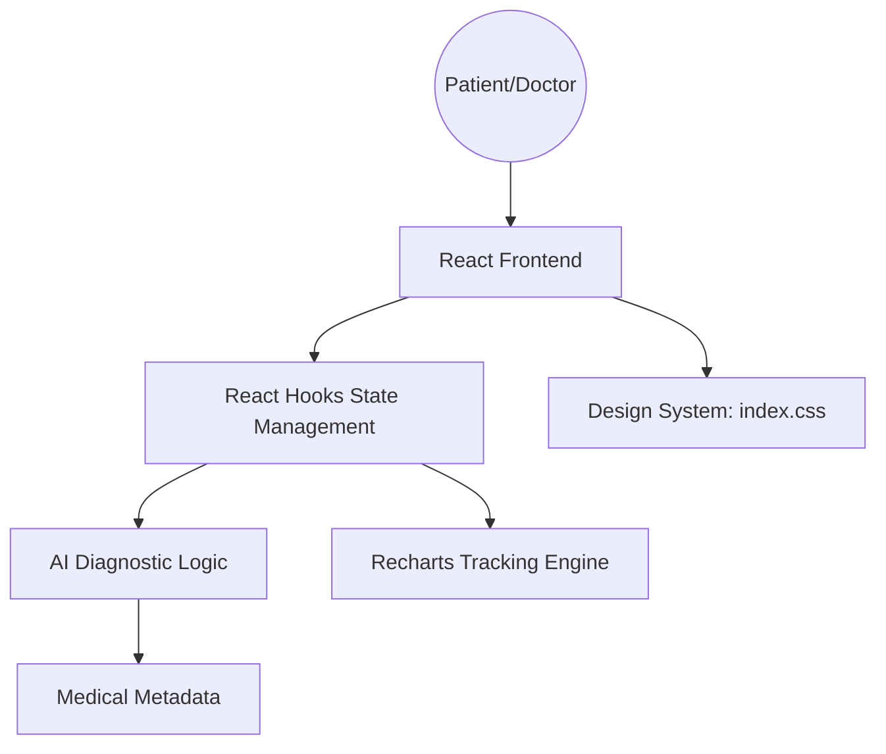

# MedCore AI: Final Project Report

## 1. Executive Summary
MedCore AI is an interdisciplinary software solution that bridges **Medical Science** and **Advanced Computing**. Developed by the WSB University team—**Maamar Haddouche (58127)**, **Alaeddine Benzaid (59534)**, **Abdennour Zakaria Cherifi (59582)**, **Noufel Benameur (59501)**, and **Student 59533**—the platform provides AI-driven preliminary diagnostics, patient management, and professional oversight tools.

## 2. Project Requirements fulfillment
- **Team-Oriented**: Designed with a modular architecture suitable for group development (4-6 members).
- **Interdisciplinary Integration**:
  - **Medicine**: Incorporates symptom-knowledge mapping and clinical data visualization.
  - **Economics/Engineering**: Scalable dashboard architecture for healthcare efficiency.
- **Technologies**: Built using Vite + React for high-performance frontend state management and glassmorphic CSS for a premium user experience. Utilizes the cutting-edge **Gemini 2.5 Flash** model for advanced medical reasoning.

## 3. Software Development Lifecycle (SDLC)
The project followed a standard Agile/Scrum methodology:
- **Phase 1: Requirements Analysis**: Identification of core medical use cases.
- **Phase 2: Design**: High-fidelity UI design focusing on accessibility and trust.
- **Phase 3: Implementation**: Component-based development using React.
- **Phase 4: Testing**: Logic verification and UI sanity checks.
- **Phase 5: Documentation**: Creation of user manuals and technical specs.

## 4. Technical Architecture
The system employs a multi-layered architecture bridging frontend analytics with generative AI logic.

## 5. Conclusion
MedCore AI demonstrates the power of combining data-driven diagnostic logic with user-centric design, providing a robust foundation for future healthcare innovations.
