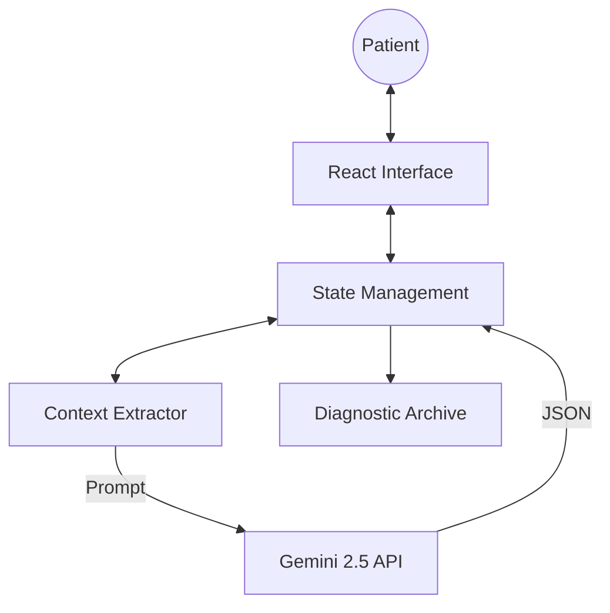

<!-- _class: title -->

# MedCore AI
### Advanced Interdisciplinary Health Intelligence & Diagnostic Platform

**Team Members:**
* Maamar Haddouche (58127) - *Lead Architect*
* Alaeddine Benzaid (59534) - *AI Specialist*
* Abdennour Zakaria Cherifi (59582) - *Data Systems*
* Noufel Benameur (59501) - *UX Engineer*
* Housseyn Azieze (59533) - *Systems Analyst*

---

# 🩺 Project Vision & Goal

- **Vision**: Empowering patients with proactive, context-aware health insights.
- **Core Goals**:
    - High-fidelity vitals monitoring.
    - Generative AI diagnostics via **Gemini 2.5 Flash**.
    - Professional-grade "Medical Glassmorphism" UX.
    - Seamless bridge between Medicine and Computer Science.

---

# 🧠 Interdisciplinary Framework

| Field | Contribution |
| :--- | :--- |
| **Medicine** | Clinical Reasoning & Longitudinal Analysis |
| **Computer Science** | Generative AI, SDK Orchestration & Async logic |
| **Data Engineering** | Real-time Metric Normalization & Persistence |
| **Psychology/UX** | Trust-building Glassmorphic Interface |

---

# 📊 Patient Portal: Real-Time Intelligence

- **Multi-Metric Dashboard**:
    - Heart Rate (BPM)
    - Blood Pressure (mmHg)
    - Oxygen Saturation (SpO2)
    - Blood Glucose Trends
- **Interactive Recharts**: Dynamic, high-fidelity visualization of the last 10 hours of health data.

---

# 🤖 The Brain: Context-Aware AI

- **Powered by Gemini 2.5 Flash**
- **Holistic Reasoning**: The AI doesn't just read symptoms; it reads your **Charts, Vitals, and Appointment History**.
- **Automated Triage**: Identifies emergency flags and provides prioritized medical advice.
- **History Informed**: Proactively references previous specialist consultations.

---

# 🏗️ Technical Architecture

*Layered approach ensures modularity and high performance.*

---

# ⚙️ Software Development Lifecycle (SDLC)

1. **Requirements**: Defining interdisciplinary medical needs.
2. **Design**: Creating a custom "Med-Glass" design system.
3. **Execution**: Agile sprints (Vite + React development).
4. **Verification**: Production-ready builds and logic auditing.
5. **Documentation**: Comprehensive technical & user manuals.

---

# ✨ Premium UI/UX Strategy

- **Aesthetic**: Medical-grade Glassmorphism.
- **Micro-Animations**: Smooth transitions for diagnostic results.
- **Branding**: WSB University institutional integration.
- **Trust**: Clean, accessible typography (Inter) and curated palette.

---

# 🏁 Conclusion & Future Scope

- **Status**: Verified production-ready MVP.
- **Future Roadmap**:
    - IoT Wearable Integration (Apple Watch/Fitbit).
    - Advanced Computer Vision for skin/symptom imaging.
    - Distributed Medical Ledger (Secure Record Sharing).

---

# 📂 Thank You!
### Any Questions?

Find all project documents in the **Project Hub**:
- Final Report
- Implementation Plan
- Individual Contributions

**[github.com/maamarh/pr_lab](https://github.com/maamarh/pr_lab)**
