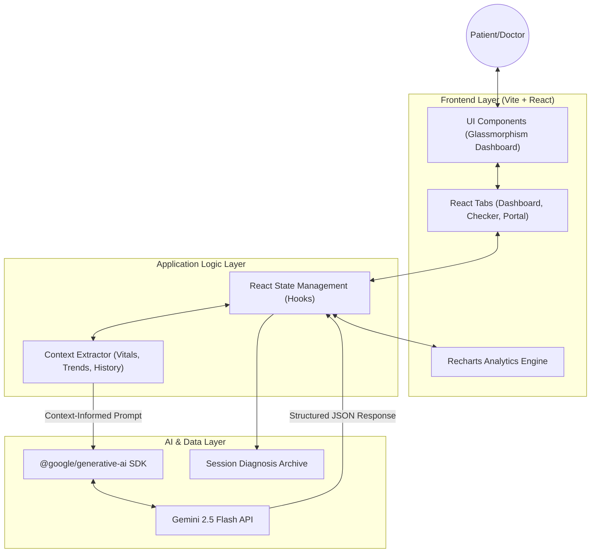

# MedCore AI: System Architecture Component

MedCore AI utilizes a robust, multi-layered architecture designed to bridge the gap between **Software Engineering** and **Clinical Health Informatics**. The system is built for scalability, context-awareness, and high-performance data processing.

## 1. High-Level System Architecture
The following diagram illustrates the interaction between the user interface, the application state, and the generative AI layer.

## 2. Context-Aware Data Flow
MedCore AI's unique "Holistic Diagnostic" capability is achieved through a precisely orchestrated data flow:

1.  **Data Collection**: The system continuously monitors patient vitals (Heart Rate, BP, SpO2, Glucose).
2.  **State Aggregation**: React states capture historical trends (e.g., bpmTrend, bpTrend).
3.  **Prompt Engineering**: Upon symptom input, the **Context Extractor** compiles these metrics into a comprehensive medical snapshot.
4.  **Generative Analysis**: The Gemini 2.5 Flash model performs longitudinal analysis, correlating current symptoms with historical trends.
5.  **Persistence**: The resulting structured JSON is rendered in real-time and archived in the consultation history.

## 3. Interdisciplinary Integration Points
| Layer | Domain | Integration Detail |
| :--- | :--- | :--- |
| **Logic Layer** | Computer Science | State encapsulation and async AI service handling. |
| **Analytics Layer** | Engineering | Data normalization for multi-metric chart rendering. |
| **Intelligence Layer** | Medicine | Generative clinical reasoning using longitudinal patient data. |
| **UI Layer** | Psychology/Design | Glassmorphic interface meant to build user trust and reduce clinical anxiety. |

## 4. Component Definitions
- **Analytics Engine**: Uses `Recharts` to transform raw vital arrays into readable trend-lines.
- **Context Extractor**: A logic component that serializes multi-dimensional health data for LLM consumption.
- **Consultation Archive**: A session-persistent storage layer for medical traceability.
- **AI Sentinel**: The Gemini 2.5 core configured with specific safety constraints for medical emergency detection.
